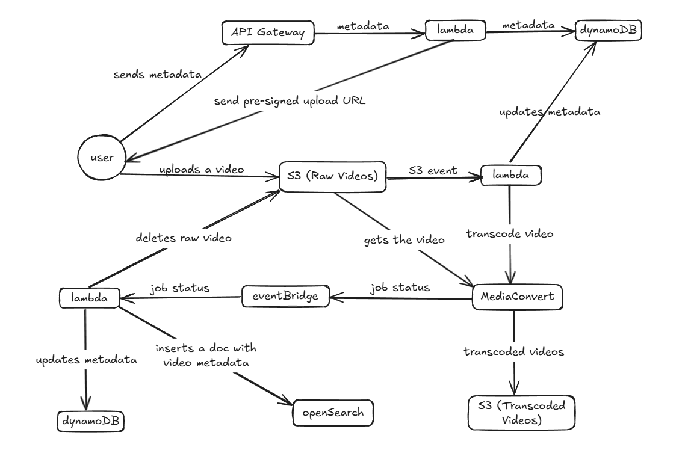

# Distributed Video Processing System

A scalable backend web application built using AWS cloud services. This project demonstrates how to architect, deploy, and interact with a cloud-native application using infrastructure as code and serverless technologies.

## 📌 Table of Contents

- [Architecture](#-architecture)
- [Tech Stack](#-tech-stack)
- [Setup](#-setup)
- [API Documentation](#-api-documentation)
- [Demo](#-demo)

---
## 🏗️ Architecture



This application follows a modular, serverless architecture hosted on AWS. Key services include:

- **API Gateway** – Exposes RESTful endpoints
- **Lambda** – Stateless backend business logic
- **DynamoDB / S3 / OpenSearch** – Persistent data storage
- **MediaConvert** – Video transcoding
- **EventBridge** – Event-driven architecture
- **Elastic Container Registry** – Container image registry
- **CDK / CloudFormation** – Infrastructure as code
- **IAM** – Role-based access control

---

## 🛠️ Tech Stack

- **Language:** Java
- **Testing:** JUnit, Mockito
- **Tools:** Postman (for API testing)
---

## ⚙️ Setup

### Prerequisites

- Java 17
- AWS CLI configured
- Node.js and NPM (for AWS CDK)
- Maven or Gradle
- Docker (optional, for local Lambda testing)

### Steps

```bash
# 1. Install dependencies
npm install -g aws-cdk
cd <your-project-folder>
mvn clean install  # or ./gradlew build

# 2. Bootstrap CDK (only once per AWS account/region)
cdk bootstrap

# 3. Deploy
cdk deploy
```
---
## API Documentation

The API documentation for this application can be found [here](https://web.postman.co/workspace/My-Workspace~28fa3d57-2335-48de-8e90-b71bcf5bcf57/collection/30385738-2d737ec8-871d-462b-9bdb-3ad369e52ca5?action=share&source=copy-link&creator=30385738).

---
## 🎥 Demo
[Watch the demo on YouTube](https://youtu.be/DPIvfWs8qfI)

---
## 🚀 Deployment

This project uses AWS CDK for infrastructure deployment and version control.

To deploy this application to AWS, follow the steps in the [Setup](#-setup) section.